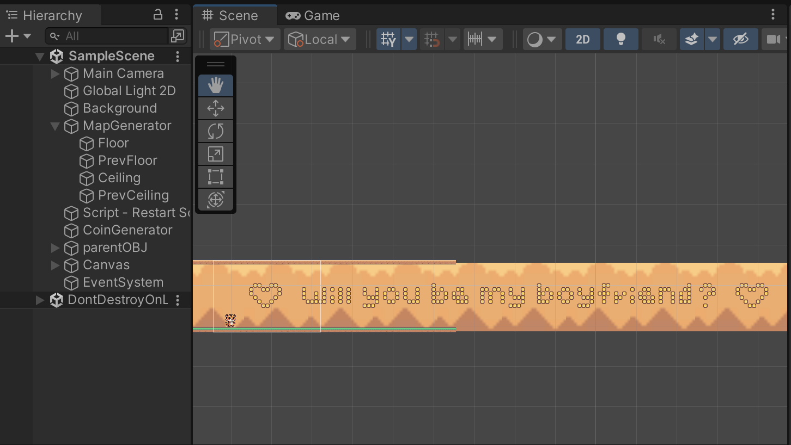

# skysurge
a game i made in Unity for someone i like :)

## 📸 Preview  

# Project Structure
Camera.cs – Manages camera behavior and perspective.
CoinGenerator.cs – Handles coin spawning mechanics.
Game_RestartScreen.cs – Controls the restart screen and game-over logic.
MapGenerator.cs – Continuously generates the game map/environment for side-scrolling effect.
Player.cs – Controls player movement and interactions.
game_scene.png – A preview image of the game scene.
video.mov – Gameplay demo video.

Assets
Prefabs/ – Contains reusable prefabs such as: Coin_gold (coin collectible), parentOBJ (a container for multiple objects)

Hierarchy Structure
- MapGenerator (Contains Floor, Ceiling, and CoinGenerator)
- Canvas (UI elements)
- EventSystem

# Future Enhancements
- Power-ups
- Sound effects and background music
- More obstacles with varying difficulties

